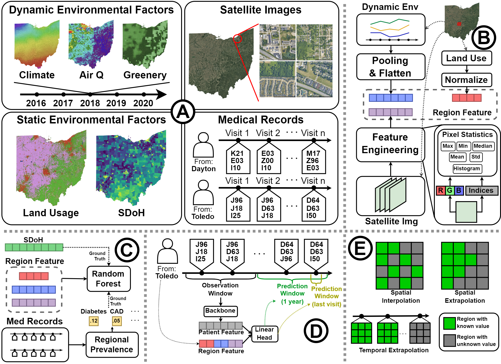

# SatHealth: A Multimodal Public Health Dataset with Satellite-based Environmental Factors

**Explore and Access SatHealth dataset with our web application at** [SatHealth Explorer](https://aimed-sathealth.net)

This repository contains the official PyTorch implementation of the following paper:

> SatHealth: A Multimodal Public Health Dataset with Satellite-based Environmental Factors
> 
> Yuanlong Wang, Pengqi Wang, Changchang Yin, Ping Zhang
> 
> Abstract: Living environments play a vital role in the prevalence and progression of diseases, and understanding their impact on patient’s health status becomes increasingly crucial for developing AI models. However, due to the lack of long-term and fine-grained spatial and temporal data in public and population health studies, most existing studies fail to incorporate environmental data, limiting the models’ performance and real-world application. To address this shortage, we developed SatHealth, a novel dataset combining multimodal temporal-spatial data, including environmental data, satellite images, all-disease prevalences, and social determinants of health (SDoH) indicators. We conducted experiments under two use cases with SatHealth: regional public health modeling and personal disease risk prediction. Experimental results show that living environmental information can significantly improve AI models’ performance and temporal-spatial generalizability on various tasks. Finally, we deploy a web-based application to provide an exploration tool for SatHealth and one-click access to both our data and regional environmental embedding to facilitate plug-and-play utilization. SatHealth is now published with data in all regions of Ohio, and we will keep updating SatHealth to cover the other parts of the US. With the web application and published code pipeline, our work provides valuable angles and resources to include environmental data in healthcare research and establishes a foundational framework for future research in environmental health informatics.

## Overview

Our Sathealth dataset consists of four components: environmental data, satellite images, all-disease prevalences, and social determinants of health (SDoH) indicators. 



## File Structure
```
.
├── assets
├── data
├── dataset
│   ├── __init__.py
│   ├── datasets.py
│   └── dataloader.py
├── model
│   ├── baselines.py
│   ├── lstm.py
│   ├── Seqmodels.py
│   └── trainer.py
├── utils
│   ├── __init__.py
│   └── metrics.py
├── 01_env_extract.py
├── 02_gen_img_features.py
├── 03_gen_multimodal_features.py
├── 04a_regression_series.py
├── 04b_train_nextvisit.py
├── 04c_correlation_analysis.py
├── README.md
└── requirement.txt
```
## Requirements

see `requirement.txt`

## Code Usage

We provide code to construct the SatHealth dataset and conduct analysis described in our paper. 

If you just want to conduct the analysis we described in the paper, you can 
1. Download SatHealth at [SatHealth Explorer](https://aimed-sathealth.net)
2. Download our embeddings at [SatHealth Explorer](https://aimed-sathealth.net)
3. unzip `sathealth_dataset.zip` and put the data under `data/processed` 
4. unzip `sathealth_embeddings.zip` and put the embeddings under `data/embeddings`
5. go directly to [Conduct Analysis](#conduct-analysis) section.

### Environmental Data Extraction

To use our script to extract satellite-based environmental data, users need a Google Cloud account with a project that enabled the Google Earth Engine service. Follow the setup process [here](https://developers.google.com/earth-engine/guides/access).

The next step is to authenticate and use the resultant credentials to initialize the Earth Engine client with the Google Earth Engine Python library. Following the process [here](https://developers.google.com/earth-engine/guides/auth)

After this setup process, fill in your Google Cloud project ID in `01_env_extract.py` line 10, select the geographic region level you want at line 13, then run the script

```bash
python 01_env_extract.py
```

It will grab environmental data from multiple satellite products on the Google Earth Engine platform and store the results in the `data/raw` folder.

### Request Satellite images from Google Maps Static API

Next, we need to request satellite images involved in SatHealth from [Google Maps Static API](https://developers.google.com/maps/documentation/maps-static). Follow The detailed steps in the **Satellite Image Extraction** section in `data/processed/README.md`.

### Integrate Multimodal Data and Produce Embeddings

Next, we will conduct the experiments on SatHealth. The first step is to construct embeddings from the multimodal data. Run

```bash
python 02_gen_img_features.py
```

Will construct an embedding vector for every satellite image in the `data/processed/images` folder and save it in `data/processed/gmap/img_features`. Moreover, it will generate regional embeddings for user-selected geographic regions at line 9, save them at `data/processed/gmap/img_features_{georegion}`. Note that this script will not overwrite existing image embeddings. If you updated the images, you should delete the embedding files and run the script again.

After that, run
```bash
python 03_gen_multimodal_features.py
```
Will combine image features with other environmental features we extracted from the Google Earth Engine, complete SatHealth construction, and produce multimodal embeddings under `data/embeddings`. Additionally, temporal-spatial enhanced embeddings will also be created. Still, the user can specify the geographic regions at line 9.

### Conduct Analysis

Scripts like `04*.py` include the code for our use cases in the paper, including the regional public health modeling and the personalized disease risk prediction. Users can run

```bash
python 04a_regression_series.py
python 04c_correlation_analysis.py
```

to produce the results for regional public health modeling tasks. The results will be saved in the `results` folder created by the scripts. 

Note that due to the data-sharing policy, we do not provide medical record data from MarketScan used for personalized disease risk prediction. Therefore, we just provide code for reference.